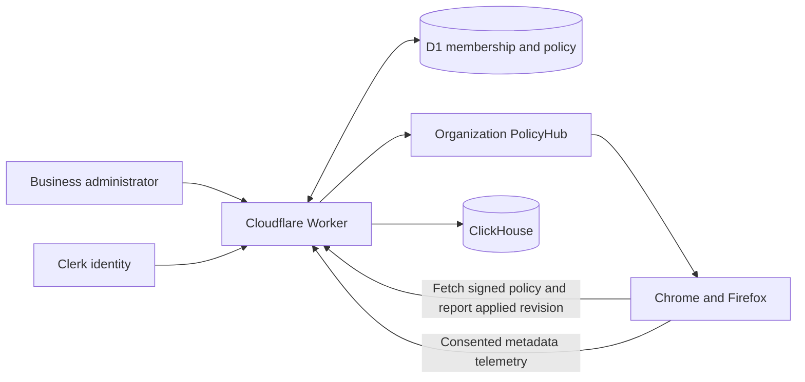

# SecureIntent v1.2.0 — final1 overview and handoff

Updated: 4 October 2026. Working branch in both repositories:
`feat/v1.2.0-business-onboarding`.

## 1. Purpose

SecureIntent helps people prevent accidental disclosure of credentials and sensitive
information while using websites and AI tools. The extension checks supported pastes
and text-file selections locally, warns or blocks according to policy, and provides
anonymisation and other protection features according to the person's entitlement.

Version 1.2.0 combines the universal detector work with Business onboarding and team
policy delivery. The Business onboarding branch contains the later work; the earlier
`feat/v1.2.0-universal-detector` branch is not the latest implementation.

For a Business team, an administrator can manage members and policy centrally.
Chrome and Firefox receive the same organization policy and revision, display the
corresponding notice, and apply the policy to supported interactions. Offline or
suspended browsers can receive updates later; delivery is not an unconditional
instantaneous guarantee.

## 2. Four onboarding journeys

| Person | Entry | Access |
| --- | --- | --- |
| Free user | Installs the extension and signs in normally | Detection, warnings and a limited Anonymise & Paste allowance; no team administration. |
| Developer Pro user | Upgrades through the normal account flow | Premium protection, including unlimited anonymisation, Rehydrate Vault, Ghost Log Sanitiser and Session Lock; no team administration. |
| Business administrator | Uses a controlled Business promo invitation, verifies their email and activates the workspace | 150 seats including the administrator, up to 149 invitations, Business console, membership/policy management, Shadow AI and reports. |
| Business member | Activates a personal invitation with the exact invited email | Organization-provided protection and policy; no admin dashboard or access to the team roster. |

The website and extension use the same Clerk identity. Ordinary sign-in does not
create a Business workspace. Business activation and membership require their
respective invitations; organization privileges are resolved by the backend.

## 3. Components and data flow

| Component | Responsibility |
| --- | --- |
| Website | Account sign-in, upgrades, controlled Business onboarding and admin console. The website was not changed during this hardening pass. |
| Chrome MV3 / Firefox MV2 extension | Local detection, paste/file guards, protection UI, signed entitlement/policy verification, account changes and bounded telemetry delivery. |
| Clerk | User identity and session verification. Chrome uses the Clerk extension SDK; Firefox reads its authorized Clerk cookies and uses the backend renewal broker when required. |
| Cloudflare Worker | Verifies sessions, resolves current access, signs configuration and entitlements, authorizes Business operations and accepts telemetry. |
| Cloudflare D1 | Current Business organizations, exact-email memberships, policy revisions and installation receipts, alongside existing application state. |
| PolicyHub Durable Object | Per-organization WebSocket notifications with short authorization leases and independent single-use connection tickets. |
| ClickHouse | Analytics events containing approved metadata and fingerprints, rather than raw clipboard or file contents. |



Policy notifications contain invalidations; each browser retrieves and verifies
the signed policy. Installation receipts record the applied revision separately
for each browser installation. Organization identity is established server-side.

## 4. Fixes completed

### Extension protection and reliability

- Corrected YAML/XML secret spans so redaction replaces the value when it also
  appears in a key or tag.
- Added file-input coverage in open shadow roots and cancelled obsolete work after
  selection replacement, resets, consent/account/policy changes or navigation.
- Bounded pending file checks and paste work; prevented stale paste replay after
  editing or navigation; added visible recovery messages for paste failures.
- Preserved Session Lock inactivity across routine entitlement renewal.
- Cleared another account's cached organization policy, including offline account
  mismatches, while retaining the same user's signed policy during ordinary outages.
- Added a durable telemetry retry queue bound to the originating identity, with
  consent checks, allowlisted metadata, bounded storage, expiry and retry backoff.
- Serialized background refreshes and added persistent alarms, deadlines and
  jittered reconnects to reduce overlapping requests and synchronized retry bursts.

### Chrome/Firefox authentication and Business synchronization

- Implemented Firefox renewal through `POST /v1/auth/session/refresh`, using live
  Clerk client proof. An expired session JWT alone cannot renew a session.
- Verified client/session/user ownership, active session state, expiry and token
  signature before returning a fixed 60-second token.
- Added request/provider size limits, an eight-second deadline and rate limits:
  3,000 requests/minute per ingress IP and six/minute per client proof, per
  Cloudflare location. Provider outages remain retryable rather than forcing logout.
- Fixed a runtime incompatibility discovered in actual workerd: provider requests
  now use `redirect: 'manual'` and reject redirects without forwarding credentials.
- Coalesced Firefox renewal requests in background memory and invalidated cached
  or pending renewal when the account's cookies change.
- Shared duplicate Clerk profile reads within one backend request. Subsequent
  requests still reload profile and D1 membership state.
- Allowed simultaneous Chrome/Firefox connections for the same member through
  independent, single-use policy tickets, bounded per user and organization.
- Coalesced heartbeat revision reads and cached successful results for five
  seconds per organization; policy publication invalidates that cache.
- Fixed Firefox injection into already-open tabs with ordered MV2 script loading.
- Scoped popup notices to account, organization and revision, so dismissing one
  revision cannot hide the next revision or another account's notice.

### Operational safeguards

- Added regression coverage for provider failures, rate limits, account/membership
  changes, ticket lifecycle, organization isolation and policy synchronization.
- Strengthened staging checks for isolated rate-limit namespaces, local Durable
  Object bindings and non-destructive migrations.
- Preserved the existing signing and entitlement contracts, Business roles and
  150-seat model. No billing change or application D1 migration was required.

## 5. Verification completed

| Check | Result |
| --- | --- |
| Extension unit/component tests | 809 passed across 70 files |
| Backend unit tests | 627 passed; three opt-in browser cases run separately |
| TypeScript | Passed in both repositories |
| Chromium regression suite | 29 passed |
| Staging preflight regressions | 24 passed |
| Firefox/Chromium backend integrations | Two passed; 22.33 seconds |
| Simultaneous browsers with actual Worker, D1 and PolicyHub | One passed; 21.39 seconds |
| Chrome/Firefox production builds and package integrity | Passed |
| Exact Firefox package smoke test | Background, HttpOnly cookies, session storage and popup passed |
| Production API/security/signature/D1 probes | Ten passed after deployment |
| Production telemetry | One synthetic anonymous event acknowledged after ClickHouse insertion |

The simultaneous-browser test used actual browser extensions, the production Worker
source in workerd, D1, SQLite Durable Objects and native WebSockets. One admin save
from revision 7 to 8 reached both existing connections for the same member. Both
notices updated, two installation receipts advanced, and already-open tabs enforced
the new rule. Another organization's subscriber received no publication. Ordered
events proved the notification triggered policy fetching before heartbeat recovery,
without polling, manual refresh or reconnection.

These local browser tests use synthetic identities and simulated external Clerk
responses; Chrome's SDK boundary is a test adapter. They do not establish complete
real-account production journeys. The local 1,000-session exercise completed with
zero failures, but is not evidence of million-user backend capacity.

## 6. Production deployment

- API: `https://api.secureintent.ai`.
- Deployed backend source commit: `08424ad`.
- Worker version: `7ba66839-3a2d-4c2b-b6b8-12fb9397ba70`, tag `final1`, verified at
  100% traffic after deployment on 4 October 2026 (Asia/Kolkata).
- Bundle SHA-256:
  `75837e4628838326240c2328b998652fbf8ef2aaa8380d66e5afda3699a8b05a`.
- Existing variables and all 12 secret binding names were preserved. Both new
  rate-limit bindings, D1 and PolicyHub are attached.
- Live checks covered health, signed public configuration and the extension's
  verification key, unauthorized entitlement/team/stream access, malformed renewal,
  invalid live Clerk proof, malformed telemetry and a D1 invitation lookup.
- One anonymous synthetic event returned `202 { accepted: 1 }` after the Worker
  awaited ClickHouse insertion. Its ID is
  `deployment-verification-7ba66839-3a2d-4c2b-b6b8-12fb9397ba70`; its site is
  `deployment-verification.secureintent.ai`. No customer content was sent.
- Direct remote D1 schema inspection was denied with Cloudflare API code `7403`.
  The deployed application's D1 lookup passed; full remote schema inspection
  remains unverified.

Previous Worker version: `2b02c9ad-50ac-4fdd-90b9-e73fe8e316f6`. Review binding and
schema compatibility before any rollback; reverting the broker removes Firefox
renewal. No rollback or store submission was performed.

## 7. Code and build locations

| Project | Local checkout | GitHub repository |
| --- | --- | --- |
| Extension | `/home/shiiit/OSS/JOB/Secureintent-Extension` | [SecureIntentAI/Secureintent-Extension](https://github.com/SecureIntentAI/Secureintent-Extension/tree/feat/v1.2.0-business-onboarding) |
| Backend | `/home/shiiit/OSS/JOB/secureintent-backend-v2` | [SecureIntentAI/secureintent-backend](https://github.com/SecureIntentAI/secureintent-backend/tree/feat/v1.2.0-business-onboarding) |

Both packages use extension version `1.2.0` and the same production API and policy
verification key. Paths below are relative to the extension checkout.

| Browser | ZIP | Unpacked folder | Bytes |
| --- | --- | --- | ---: |
| Chrome MV3 | `dist/final1.zip` | `dist/final1.mv3/` | 3,635,192 |
| Firefox MV2 | `dist/final1.firefox.zip` | `dist/final1.firefox/` | 3,570,638 |

SHA-256 checksums:

```text
bccff449cd849b12e378d5c5721c1c133f990b07ee9c6efc2367eab76fcfa497  final1.zip
0e9d5f07bb54ea97b578ecce8ad6434c52acb062e60812f1c504201d9995ea69  final1.firefox.zip
```

Chrome: use **Load unpacked** with `dist/final1.mv3/`. Firefox: temporarily load
the manifest in `dist/final1.firefox/` through `about:debugging`; permanent public
distribution requires the appropriate Mozilla signing/review process.

Build outputs under `dist/` are ignored by Git and remain local artifacts. This
source push includes implementation, tests and documentation. Older pilot/test
directories and archives are separate local artifacts.

## 8. Reproducing checks

From the extension checkout, run the relevant commands separately:

```sh
pnpm compile
pnpm test
HEADLESS=1 pnpm e2e
pnpm build
pnpm build:firefox
```

Standard builds output `dist/chrome-mv3/` and `dist/firefox-mv2/`; the `final1`
names above identify the checked release copies and archives.

From the backend checkout:

```sh
pnpm compile
pnpm test
node scripts/check-staging-config.check.mjs
SI_BROWSER_INTEGRATION=1 pnpm exec vitest run --no-file-parallelism test/extension-browser.integration.test.ts test/extension-policy-live.integration.test.ts
```

The browser integration requires the extension checkout beside the backend
checkout, or `SI_EXTENSION_REPO` pointing to it, and the local Firefox/Chromium
test dependencies. Keep the integration files sequential because WXT shares its
generated directory. Their disposable builds do not replace the production ZIPs.

## 9. Remaining checks and limits

1. Exercise real signed-in production accounts across all four onboarding journeys,
   including expired-session renewal, exact-email invitations, member removal and
   account switching.
2. Verify an actual administrator and two invited seats across Chrome and Firefox:
   matching revision, notice, enforcement and current receipts after a policy save.
3. Verify organization-attributed telemetry in ClickHouse. The successful anonymous
   deployment probe does not establish Business attribution.
4. Complete remote D1 schema inspection with suitable read-only permissions.
5. Measure capacity, provider quotas, costs and recovery under realistic concurrent
   usage. One million downloads and one million active installations are different
   workloads; neither production capacity nor zero defects is guaranteed by tests.
6. Complete Chrome Web Store/AMO release review and distribution as appropriate.

Coverage is for supported paste and text-file paths. Binary files, closed shadow
roots and custom/programmatic upload paths can require separate integration work.
Telemetry queues are bounded: prolonged outages can expire or evict events, and
lost acknowledgements can still produce duplicates. Offline signed policy retention
is separate from fresh online membership authorization.

Detailed evidence: [extension hardening](docs/hardening.md),
[Firefox launch notes](docs/FIREFOX_LAUNCH.md), and
[backend handoff](https://github.com/SecureIntentAI/secureintent-backend/blob/feat/v1.2.0-business-onboarding/docs/extension-session-hardening.md).
